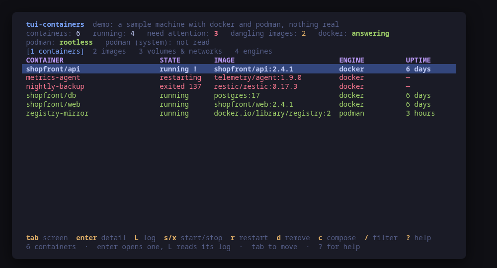
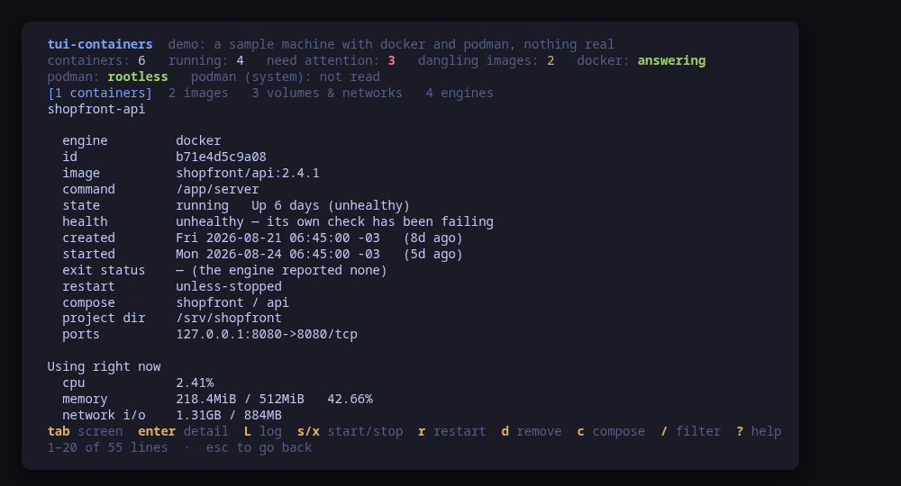
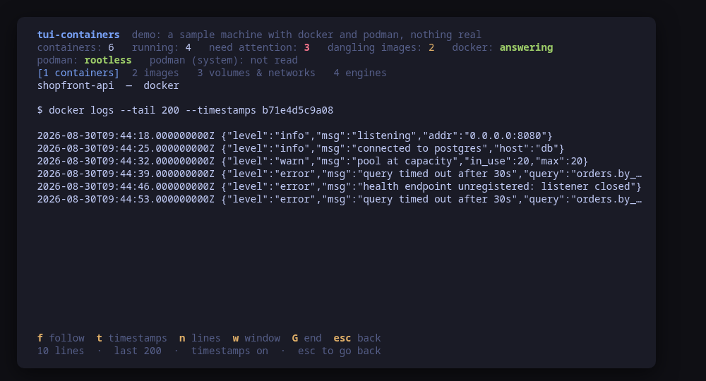
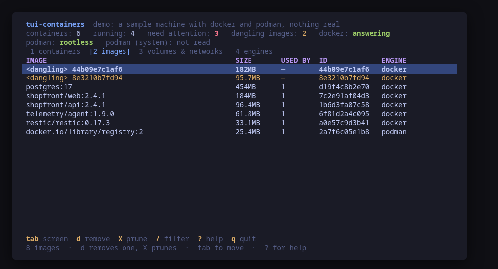
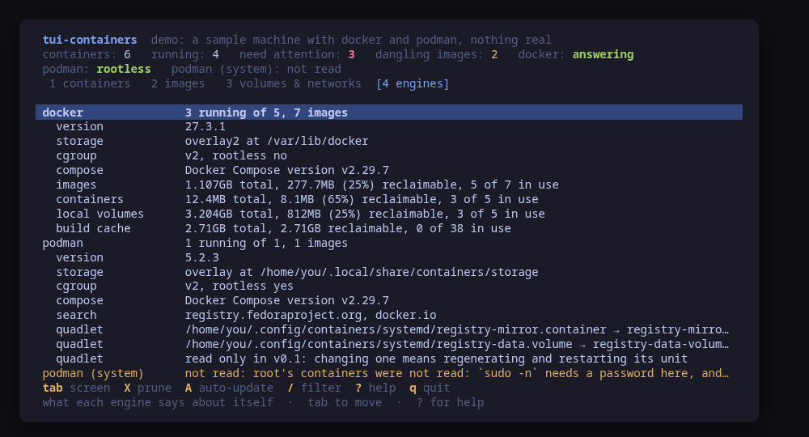
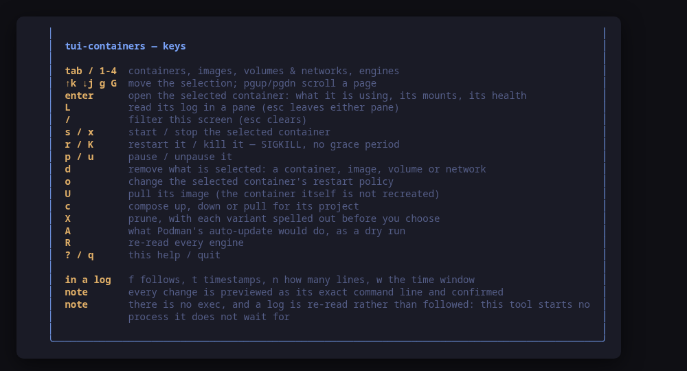

[](https://scorecard.dev/viewer/?uri=github.com/tui-tools/tui-containers)
[](https://www.bestpractices.dev/projects/14368)

> **Beta.** The family is days old and still changing. Package names, flags
> and keys may move without notice until 1.0. Pin versions, and report what
> breaks.

Every container on the machine, on one screen. **Docker and Podman together**,
worst first, with the **exact command line of every change previewed before it
runs**.

`docker ps` knows nothing about your Podman containers, `podman ps` knows
nothing about root's, and neither of them will tell you why the one in the
middle is unhealthy. `tui-containers` puts them on one list, in the
[Omarchy](https://omarchy.org) visual style.



> **Status: early, under validation.** An independent tool that follows the
> Omarchy visual style; it is **not** part of the Omarchy project and not
> endorsed by its maintainers. Expect rough edges.

## Install

<!-- install:start -->
<!-- Generated by tui-kit/tools/render-install.py from tool.json. -->
<!-- Edit the manifest, then run `make readme`. -->

### Arch Linux

Needs the tui-tools repository, which is a [one-time
setup](https://tui-tools.github.io/install/).

The one-liner detects the distribution and adds the repository and its signing
key:

```sh
curl -fsSL https://pkgs.tui.tools/install.sh | sh
```

Piping a script into a shell is not this family's style, so here is the same
setup by hand — read it, or read the script first with `curl -fsSL
https://pkgs.tui.tools/install.sh -o install.sh`:

```sh
curl -fsSL -o /tmp/tui-tools.asc https://pkgs.tui.tools/pubkey.asc
sudo pacman-key --add /tmp/tui-tools.asc
sudo pacman-key --lsign-key \
  "$(gpg --show-keys --with-colons /tmp/tui-tools.asc | awk -F: '/^fpr:/{print $10; exit}')"
printf '[tui-tools]\nServer = https://pkgs.tui.tools/arch/$arch\n' \
  | sudo tee -a /etc/pacman.conf
sudo pacman -Sy
```

Then, and for every other tool in the family:

```sh
sudo pacman -S tui-containers
```

Upgrades then arrive with the rest of your system updates.

### Debian and Ubuntu

Needs the tui-tools repository, which is a [one-time
setup](https://tui-tools.github.io/install/).

The one-liner detects the distribution and adds the repository and its signing
key:

```sh
curl -fsSL https://pkgs.tui.tools/install.sh | sh
```

Piping a script into a shell is not this family's style, so here is the same
setup by hand — read it, or read the script first with `curl -fsSL
https://pkgs.tui.tools/install.sh -o install.sh`:

```sh
sudo install -d -m 0755 /etc/apt/keyrings
curl -fsSL https://pkgs.tui.tools/pubkey.asc \
  | sudo gpg --dearmor -o /etc/apt/keyrings/tui-tools.gpg
echo "deb [signed-by=/etc/apt/keyrings/tui-tools.gpg] https://pkgs.tui.tools/deb stable main" \
  | sudo tee /etc/apt/sources.list.d/tui-tools.list
sudo apt update
```

Then, and for every other tool in the family:

```sh
sudo apt install tui-containers
```

Upgrades then arrive with the rest of your system updates.

### Fedora and RHEL

Needs the tui-tools repository, which is a [one-time
setup](https://tui-tools.github.io/install/).

The one-liner detects the distribution and adds the repository and its signing
key:

```sh
curl -fsSL https://pkgs.tui.tools/install.sh | sh
```

Piping a script into a shell is not this family's style, so here is the same
setup by hand — read it, or read the script first with `curl -fsSL
https://pkgs.tui.tools/install.sh -o install.sh`:

```sh
sudo rpm --import https://pkgs.tui.tools/pubkey.asc
sudo curl -fsSL -o /etc/yum.repos.d/tui-tools.repo https://pkgs.tui.tools/rpm/tui-tools.repo
sudo dnf makecache
```

Then, and for every other tool in the family:

```sh
sudo dnf install tui-containers
```

Upgrades then arrive with the rest of your system updates.

### Any distribution, static binary

```sh
curl -fsSL https://github.com/tui-tools/tui-containers/releases/download/v0.2.1/tui-containers_0.2.1_linux_amd64.tar.gz | tar -xz tui-containers
sudo install -m0755 tui-containers /usr/local/bin/tui-containers
```

One static binary. Verify it against checksums.txt from the same release.

### From source

```sh
git clone https://github.com/tui-tools/tui-containers
cd tui-containers && make build
sudo install -m0755 bin/tui-containers /usr/local/bin/tui-containers
```

Needs Go 1.27 or newer.

Not packaged for these yet; the static binary works everywhere in the meantime.

### Arch Linux (AUR) — coming soon

```sh
paru -S tui-containers-bin
```

The -bin package installs the released static binary.

### openSUSE — coming soon

Needs the tui-tools repository, which is a [one-time
setup](https://tui-tools.github.io/install/).

```sh
sudo zypper install tui-containers
```

The rpm repository is shared with dnf; zypper support is not tested yet.

### Verify a download

Every release of `tui-containers` ships a `checksums.txt`. Check an archive
against it before installing:

```sh
sha256sum -c checksums.txt --ignore-missing
```
<!-- install:end -->

One static binary, no daemon, no state of its own. Nothing keeps running after
you quit.

## Try it without root

```sh
tui-containers --demo
```

`--demo` runs against a sample machine with both engines: a Compose project of
three services with one of them unhealthy, a backup job the out-of-memory killer
left at exit 137, a container stuck in a restart loop, two dangling images from a
rebuild, and root's Podman reported as unread because `sudo -n` would have needed
a password. Every key works, every command is built and previewed for real, and
nothing touches your system.

## What is wrong comes first

The list is sorted by what a reader wants first, not alphabetically and not by
age. A container that **exited non-zero**, one that is **restarting**, one its
own **health check** disagrees with, and one the engine gave up on all sort to
the top; then what is running; then everything else.

A container that exited **0** is not in that band. A one-shot job that ran and
finished is the most ordinary thing on a machine, and colouring it red would
train you to ignore the colour.

Health is three states, not two. A container with **no** `HEALTHCHECK` is not
healthy — it is unjudged, and the screen says so in those words rather than
leaving a blank that reads like approval. And a stopped container keeps its last
health verdict forever, so one that was unhealthy when it was killed in March
still says "unhealthy" today; those are not counted, because they are a fact
about the past.

## One container, in full



`enter` opens the row: what it is using right now from a single
`stats --no-stream` sample, the limits it was created with (where a zero is
reported as *unlimited*, which is what a zero means), its mounts and which of
them it can write to, the networks it is on and at which address, and what its
health check has actually been printing — which is the answer to the question
the red row asked.

The exit status is read back in English. `137` is not a number to look up: it is
SIGKILL, which is usually the machine running out of memory or a stop that timed
out. `143` is an ordinary SIGTERM.

**Environment values are masked by name.** Any variable whose name contains
`PASS`, `SECRET`, `TOKEN`, `KEY` or `CREDENTIAL` shows its name and not its
value. It over-matches on purpose — a `PUBLIC_KEY` is masked too — because a
mask on something harmless costs a keystroke and a leaked token costs a
rotation. The name is always on screen: knowing that `DATABASE_PASSWORD` is set,
and that what you are looking at is not it, is the useful half.

## Logs, without leaving anything running



`L` opens a pane on `logs --tail`, and the command line that produced it is the
first thing in it. `f` follows by **re-reading on a timer** rather than by
starting `logs -f`, because a follow is a process that never returns and this
tool starts none: every command it runs is one it waits for, and one you could
have run yourself.

`t` toggles `--timestamps`, `n` cycles how many lines, `w` cycles the `--since`
window. The pane's keys are its own — a stray `d` in a log does not remove the
container behind it.

## Images, volumes and networks



`2` is what is in the stores and what it costs. **Dangling** images — the layers
a rebuild left behind that no tag points at — are marked and sorted to the top,
because they are the ones that can simply go.

The **used by** column is counted from the containers on screen rather than
asked of the engine. That is deliberate: an image marked unused next to a
container created from it would be the worst kind of wrong, and the answer
computed from the rows in front of you is the one that agrees with them. The
same goes for a volume marked free next to the container mounting it.

`3` is the volumes and the networks on one screen, because they are the two
things a container leaves behind and both are answered by the same question — is
anything still using this.

## Every prune is a sentence before it is a flag

`X` opens a list of what could be removed, written out:

```
dangling images only
every image no container uses (-a)
unused volumes — deletes data
unused networks
system prune: stopped containers, dangling images, unused networks
system prune -a --volumes: also every unused image and volume
```

You pick a sentence; the dialog then shows the command line it produced and what
it will do. `-a` and `--volumes` are never added for you, because they are the
difference between removing what is unused and removing what is merely not
running.

**"Unused" does not mean "unneeded".** A volume is unused when no container
exists that mounts it — so a database volume whose container was removed an hour
ago is unused, and it is the database. The dialog says that, in those words,
every time.

## Compose projects, driven by their own labels

`c` runs `compose up -d`, `down` or `pull` for the project the selected
container belongs to. The project name, the working directory and the compose
files all come from the labels Compose itself wrote on the containers —
`com.docker.compose.project`, `.project.working_dir` and `.project.config_files`
— so the command is exact:

```
docker compose --project-name shopfront --project-directory /srv/shopfront \
  -f /srv/shopfront/compose.yaml up -d
```

Nothing is guessed. A project whose containers carry no working directory label
cannot be driven from here, and the refusal says which label is missing rather
than running Compose in whatever directory this tool happens to be in.

## Podman is two engines, not one



Rootless Podman and root's Podman are **separate sets of containers**, not two
views of one: different storage, different networking, and root cannot see yours
without becoming you. Both are listed when both answer, each row saying which it
came from, and every action goes to the scope its row came from.

Root's are read through `sudo -n`, which never prompts. Where that needs a
password — which is most laptops — the screen says the system scope was not
read, with the reason, rather than reporting that root runs nothing.

Docker has one scope and a different question: whether this account can reach
the socket. An account in the `docker` group or a rootless daemon reaches it
directly; otherwise the tool retries the probe **once** through `sudo -n` and
the header says it did.

**Quadlet** files are listed where Podman 4.4 or newer put them —
`~/.config/containers/systemd` and `/etc/containers/systemd` — with the unit
each one generates. They are read only in v0.1: a Quadlet file is the *source*
of a container rather than a container, and changing one means regenerating and
restarting a unit, which is
[tui-systemd](https://github.com/tui-tools/tui-systemd)'s job.

`A` previews `podman auto-update --dry-run`. Only the dry run is offered: the
real one pulls and restarts every unit carrying the `io.containers.autoupdate`
label, chosen by a label rather than by the person pressing the key.

## Making one, with the same promise as changing one

Every other key on this list acts on something already here. `N`, `n` and `P`
are the three that put something new on the machine, and they are held to the
same rule: you answer a few questions, you read the exact command line they
produced, and only then does anything run.

`N` opens a form with six fields — the image, a name, the published ports, the
mounts, an `--env-file` path and a restart policy — and turns them into one
line:

```
docker run -d --name edge -p 8080:80 -p 5353:53/udp \
  -v /srv/site:/usr/share/nginx/html:ro -v static:/var/cache \
  --env-file /etc/edge.env --restart unless-stopped nginx:1.27
```

It is always `-d`. A container in the foreground is a process that does not
return, and this tool starts none.

**There is no field for an environment value, and there will not be one.** A
secret typed into a form is on screen, in the preview, in the shell history of
anyone who copies the preview, and in `docker inspect` for as long as the
container exists. `--env-file` is the same feature with the value read by the
engine out of a file whose mode you already control.

Every field is checked before it can reach an argv, in words that say which rule
was broken: a port is `host:container` with an optional `/tcp`, `/udp` or
`/sctp`, and a bare `80` is refused rather than quietly published to a random
port; a mount source is an absolute path or the name of a volume, because a
relative path is read by both engines as a volume name and would create one; an
`--env-file` is absolute. A refusal leaves the form open, because it is about
one field and closing it would throw away the other five.

`n` on screen `3` creates a volume or a network, opened on whichever of the two
the selected row is. `P` on screen `2` pulls an image by the reference you type,
which is the only way for an image the machine has never run to reach it — `U`
can only ever refresh one a container was already created from.

All three go to the engine the selected row belongs to. On a machine with both
engines there is no such thing as "the" engine, and a container created in the
store nobody was looking at is a container nobody will find.

A container created here is owned by this tool and by nothing else. Compose and
Quadlet each own the containers they made, and neither will adopt this one — the
confirm dialog says so before you answer.

## There is no `exec`

An interactive shell in a container is the one thing this tool will not do, and
it is not an oversight. The family's whole promise is that the command line you
were shown is the command line that ran; a shell is a session, not a command,
and nothing about what happens inside it can be previewed. Run
`docker exec -it <name> sh` yourself — the name is on the screen in front of
you.

## Usage

```sh
tui-containers                 # drive the real machine
tui-containers --demo          # sample machine, no privileges needed
tui-containers --check         # read every engine, print JSON, exit
tui-containers --report        # print what a bug report needs, exit
tui-containers --theme ~/mytheme/colors.toml
tui-containers --sudo ""       # never escalate; root's podman is then not listed
tui-containers --version
```

### `--check`, for scripts and tests

`--check` is the non-interactive read path: it loads every engine through the
same backend the UI would use, prints what it parsed as JSON and exits 0. No UI,
and it never builds or runs a mutation, so it is safe to run anywhere.

**It exits 0 on a machine with no engine at all.** That is the one place this
tool's `--check` differs from its siblings': a server that runs no containers is
a normal server, not a broken one, and the honest report is an empty engine list.

```console
$ tui-containers --check | head -24
{
  "tool": "tui-containers",
  "version": "0.1.0",
  "backend": "host",
  "describe": "docker as docker · podman rootless",
  "engines": [
    {
      "engine": "docker",
      "installed": true,
      "available": true,
      "version": "27.3.1",
      "rootless": false,
      "storageDriver": "overlay2",
      "cgroupVersion": "2",
      "compose": true,
      "escalated": false,
      "quadlets": 0
    },
    {
      "engine": "podman",
      "scope": "system",
      "installed": true,
      "available": false,
```

It exists so a test can assert on what the tool *parsed* rather than on what it
painted — that the container count matches `docker ps -a`, that an engine is
reported present exactly when its binary is there and answers, and that every
state is reported so a zero can be compared against.

[tui-lab](https://github.com/tui-tools/tui-lab) uses it to test this tool
against real machines on Ubuntu, Fedora and Arch; the assertions live in
[`test/smoke.sh`](test/smoke.sh), every one of them is read-only, and **none of
them pulls an image**.

### `--report`, for bug reports

`--report` prints, in one block, everything a maintainer has to ask for
otherwise: the tool and kit versions, which engines this machine has and at
which versions, the distribution, the kernel, the terminal, the theme, the
escalation prefix, and whether the running binary came from a package. It needs
no privileges and reads no engine — it asks each one for its version and
nothing else — so it works on the machine where the bug is, including one where
the socket cannot be reached at all, which is itself a thing worth reporting.

```console
$ tui-containers --report
tui-containers 0.1.2 (kit v0.2.9)
backend: host (version unknown: the machine itself; the engine versions are on the engines line)
mode: live
distro: fedora 42 (Fedora Linux 42 (Workstation Edition))
kernel: 6.19.14-108.fc42.x86_64
arch: x86_64
locale: en_US.UTF-8
term: xterm-256color
theme: tokyo-night
sudo: sudo -n
root: no
binary: /usr/bin/tui-containers (packaged)
engines: docker 29.5.3, podman 5.8.2
```

The engines line is the one that answers most reports: an action refused by a
Podman below 5.0 and one refused by a bug look exactly the same from the
outside. An engine that is not installed, or whose version could not be read,
is named there with the reason rather than left out.

The block is written to be published as it is: it carries no hostname, user
name, home path or address, and no environment variable beyond `LANG`,
`LC_ALL`, `TERM` and `TERM_PROGRAM`. A binary living under your home directory
is reported as being there without naming the path. `--report` works with
`--demo` too, where it says so on the `mode` line.

The bug form asks for this block first — see
[`.github/ISSUE_TEMPLATE/bug_report.yml`](.github/ISSUE_TEMPLATE/bug_report.yml).

## What it can do to your machine

Every one of these is previewed and confirmed first.

| Key | What runs |
| --- | --- |
| `s` / `x` | `docker start` / `stop <id>` — or `podman`, for a row from Podman |
| `r` | `docker restart <id>` |
| `K` | `docker kill <id>`, with the dialog saying what SIGKILL means |
| `p` / `u` | `docker pause` / `unpause <id>` |
| `d` on a container | `docker rm <id>`, or `docker rm -f <id>` when you pick the forced removal |
| `d` on an image | `docker rmi <ref>`, refused while a container uses it |
| `d` on a volume / network | `docker volume rm <name>` / `docker network rm <name>`, refused while in use |
| `o` | `docker update --restart=<policy> <id>` |
| `U` | `docker pull <image>` — and nothing else: the container is not recreated |
| `P` on an image | `docker pull <ref>` for a reference you type, so a new image can reach the machine |
| `N` | `docker run -d [--name …] [-p …] [-v …] [--env-file …] [--restart …] <image>` |
| `n` on a volume row | `docker volume create [--driver …] <name>` |
| `n` on a network row | `docker network create [--driver …] <name>` |
| `c` | `docker compose --project-name … --project-directory … -f … up -d` / `down` / `pull` |
| `X` | `docker image prune [-a] -f`, `volume prune -f`, `network prune -f`, `system prune -f [-a] [--volumes]` |
| `A` | `podman auto-update --dry-run` |

Nothing else. Every reference in those commands comes from the engine's own
output and is checked against a pattern before it reaches an argv. A row from
Podman produces `podman …` and, in the system scope, `sudo -n podman …` — read
from the row rather than assumed, so a command previewed against root's Podman
cannot run against yours.

## Keys

| Key | Action |
| --- | --- |
| `tab` / `1`–`4` | Containers, images, volumes and networks, engines |
| `↑`/`k`, `↓`/`j` | Move the selection, or scroll a pane |
| `g` / `G` | First / last row |
| `pgup` / `pgdn` | Scroll a page |
| `enter` | Open the selected container in full |
| `L` | Read its log in a pane |
| `esc` | Leave a pane |
| `/` | Filter this screen (`esc` clears) |
| `s` / `x` | Start / stop the selected container |
| `r` | Restart it |
| `K` | Kill it — SIGKILL, no grace period |
| `p` / `u` | Pause / unpause it |
| `d` | Remove what is selected: a container, an image, a volume or a network |
| `o` | Change its restart policy in place |
| `U` | Pull its image (the container is not recreated) |
| `N` | Run a new container from an image, detached, previewed first |
| `n` | On screen `3`: create a volume or a network |
| `P` | On screen `2`: pull an image by reference |
| `c` | `compose up`, `down` or `pull` for its project |
| `X` | Prune, with each variant spelled out first |
| `A` | What Podman's auto-update would do, as a dry run |
| `R` | Re-read every engine |
| `?` | Help |
| `q` | Quit |

In the **log pane**: `f` follows, `t` toggles timestamps, `n` cycles how many
lines, `w` cycles the time window, `G` jumps to the end.



## What v0.1 can do

- List every container on the machine as one set: Docker's, rootless Podman's,
  and root's Podman where `sudo -n` can reach it — sorted worst first, with
  Compose members kept together.
- Show the state, the image, the engine, the uptime and the published ports,
  with the engine's own status sentence never rewritten.
- Open one container in full: a live `stats` sample, its limits, mounts,
  networks, health-check log and environment, with secret-shaped values masked.
- Read a container's log in a pane, following by re-reading rather than by
  leaving a process running.
- Start, stop, restart, kill, pause and unpause a container, each refusing in
  the terms of the state it is actually in.
- Remove a container, an image, a volume or a network — each refusing while
  something still uses it, and the forced variants being a choice you make.
- Change a restart policy in place with `update --restart`.
- Pull a container's image, saying plainly that this does not recreate it, and
  pull an image the machine has never run by typing its reference.
- Run a new container from an image with `N`: a name, published ports, mounts,
  an `--env-file` path and a restart policy, previewed as the whole `run -d`
  line before anything is created.
- Create a named volume or a network with `n`, on the engine the selected row
  belongs to.
- Drive a Compose project from the labels Compose wrote, on either engine.
- Preview every prune as a sentence, with `-a` and `--volumes` never implied.
- List the Podman Quadlet units and preview `auto-update --dry-run`.
- Report what each engine says about itself, including `system df`, and why one
  that is installed did not answer.
- Follow the active Omarchy theme, and respect `NO_COLOR`.

## What v0.1 cannot do

- **No `exec`.** See above: a shell is a session, not a previewable command.
- **No environment value typed into a form.** `N` takes an `--env-file` path and
  nothing else. An inline `-e NAME=value` would put the value on screen, in the
  preview, and in `inspect` for as long as the container exists; a file the
  engine reads itself is the same feature without any of that.
- **No `run` beyond those six fields.** A container needs a hundred flags and
  this form offers six. Anything else — a capability, a user, a health check, a
  device — belongs in a Compose file or a Quadlet unit, which is a file you can
  read back, not a form somebody filled in once.
- **No recreating a container after a pull.** The image is fetched; recreating
  is the job of whatever created it — a Compose project, a Quadlet unit — and
  doing it here would mean recreating it differently.
- **No editing a Quadlet file.** They are listed and read; changing one means
  regenerating and restarting a unit.
- **No building images.** `docker build` belongs to a repository, not to a list
  of running containers.
- **No registries, no `login`, no `push`.** The tool opens no network connection
  of its own; `pull` is the only command that reaches one, and it is the
  engine's connection, not this tool's.
- **No Kubernetes, no swarm, no remote hosts.** This is the machine in front of
  you.

## Compatibility

<!-- compat:start -->
<!-- Generated by tui-kit/tools/render-compat.py from tool.json. -->
<!-- Edit the manifest, then run `make readme`. -->

`tui-containers` probes its backend once at startup and shows the version in
the header. A version nobody has tested is marked `(untested)` there rather
than hidden; one below the minimum is marked as such and the tool still runs.

### docker

| | |
| --- | --- |
| Binary | `docker` |
| Version read with | `docker --version` |
| Minimum | 20.10 |
| Tested | none yet |
| Version-gated features | `format-json` (since 23.0) |

| Versions | What changes |
| --- | --- |
| `<23.0` | `--format json` as a shorthand does not exist, so every list is read with `--format '{{json .}}'` instead. Nothing is lost: it is the same output, and it is what the shorthand expands to |
| `>=20.10` | `docker --version` answers without a daemon, which is why it is the version probe: a machine with the CLI installed and dockerd stopped reports its version and then reports the daemon as not answering, with the reason |
| `>=20.10` | the label list `docker ps` prints is every label joined with commas and nothing is escaped, so a label value containing a comma can be mis-split. The Compose labels this tool reads never contain one |
| `>=20.10` | reading needs whatever the docker socket needs: an account in the `docker` group or a rootless daemon reaches it directly, and otherwise the tool retries the probe once through `sudo -n` and says in the header that it did |

### podman

| | |
| --- | --- |
| Binary | `podman` |
| Version read with | `podman --version` |
| Minimum | 4.0 |
| Tested | `5.8.1` |
| Version-gated features | `quadlet` (since 4.4), `compose` (since 4.7), `update-restart` (since 5.0) |

| Versions | What changes |
| --- | --- |
| `<4.4` | Quadlet did not exist, so the `~/.config/containers/systemd` and `/etc/containers/systemd` directories are not read and no unit files are listed on the engines screen |
| `<4.7` | `podman compose` does not exist, so a Compose project is listed and grouped but cannot be driven from here. Before 4.7 a project was run by calling podman-compose directly, which takes different arguments |
| `<5.0` | `podman update --restart` does not exist — `podman update` arrived in 4.3 carrying only the resource limits — so the restart policy key refuses with that reason instead of running a command Podman would reject |
| `>=4.0` | rootless and root are two separate sets of containers, not two views of one. Both are listed when both answer; root's are read through `sudo -n`, and where that needs a password the screen says the system scope was not read |
| `>=4.0` | an infra container — the pause process holding a pod's namespaces open — is dropped from the list. It runs nothing anyone wrote, and showing one per pod would be an unexplained extra row |

The tested versions are generated from `compat/results.jsonl`, which the tool's
own smoke test appends to when it runs against a real machine in
[tui-lab](https://github.com/tui-tools/tui-lab).
<!-- compat:end -->

## Configuration

`/etc/tui-containers/config.toml`, then `~/.config/tui-containers/config.toml`
(the user file overrides the machine-wide one), then `TUI_CONTAINERS_*` in the
environment. Flags override everything. See
[`examples/config.toml`](examples/config.toml).

```toml
# Privilege escalation prefix; "" runs the command directly.
sudo = "sudo -n"

# Path to an Omarchy-style colors.toml; empty follows the active theme.
theme = ""
```

`sudo` decides more here than in most of the family: it is what reaches root's
Podman, and what an unreachable Docker socket is retried through. Setting it to
`""` is a real choice, not just a safety measure.

## Theme

The default palette is **Tokyo Night**. On Omarchy, the tool reads the active
desktop theme from `~/.config/omarchy/current/theme/colors.toml` and follows it.
`TUI_THEME` or `--theme` override; `NO_COLOR` drops color and keeps layout. The
rules live in [tui-kit](https://github.com/tui-tools/tui-kit#theme-rules).

## Architecture

The UI never builds a `docker` or `podman` command line. It talks to
`internal/container.Backend`, which returns an engine-neutral model:

```
Model{Engines, Containers, Images, Volumes, Networks, Projects}
Container{ID, Name, Target, Image, State, Status, Health, Created, Started,
          Uptime, ExitCode, RestartPolicy, Ports, Networks, Mounts, Project}
Target{Engine, Scope}
```

`Target` is what keeps one type honest about two engines and three scopes. Every
row carries the one it came from, and an `Action` built from a row carries that
same target to the runner — so the preview and the execution reach the same
engine in the same scope by construction.

Two packages start a process — `internal/docker` and `internal/podman` — and
[`check-exec.sh`](https://github.com/tui-tools/tui-kit/blob/main/tools/check-exec.sh)
fails the build if any other package imports `os/exec`. `internal/engines` joins
them into the one backend the UI sees and starts nothing itself:

```
docker / podman ps, images, volume ls, network ls   the lists
docker / podman info, system df                     what each engine is and costs
docker / podman inspect, stats --no-stream          one container, in full
docker / podman logs --tail                         the log pane
docker / podman compose                             a project, from its own labels
```

Mutations are `runner.Command` values produced by a backend. The UI shows them
and, on confirmation, hands the same ones back to the
[kit runner](https://github.com/tui-tools/tui-kit#the-contract-preview-confirm-run),
which resolves the binary and the privilege prefix. That is the whole trust
boundary, and it is why the preview is guaranteed to match what executes.

## Development

```sh
make check        # gofmt, go vet, the exec boundary and the tests: what CI runs
make test
make build
make demo
make screenshots  # re-render the frames above from --demo
```

The parser tests run against captured output in `internal/docker/testdata` and
`internal/podman/testdata`. Nearly all of it is real: `docker ps`,
`docker images`, `docker info`, `docker inspect`, `docker system df` and their
Podman counterparts all answer to an account that can reach the store, so those
files are what a Fedora 42 host printed, with the home path and the project
names rewritten. The two `stats.json` fixtures are written by hand and say so:
that host had no running container to sample.

The fixtures earn their keep on the differences between the two engines, which
are exactly where a parser written against one of them breaks against the other.
Docker prints one JSON object per line with every field flattened to a string —
its label list is comma-joined and nothing is escaped — while Podman answers with
an array of typed objects, its ports as structures, its times as seconds, and
its network keys in lower case where every other command's are capitalised.

Dependencies are deliberately small: Bubble Tea, Bubbles and
[tui-kit](https://github.com/tui-tools/tui-kit), which carries the palette, the
widgets, the config loader and the command runner shared by the whole family.

## Safety notes

- **`rm -f` kills before it removes.** Removing a running container is offered
  as a choice between stopping it first and killing it, never as a flag added
  quietly.
- **`kill` is SIGKILL.** Nothing is flushed, no shutdown handler runs, and a
  database in the middle of a write finds out on the next boot. `x` sends
  SIGTERM and waits.
- **A prune with `--volumes` deletes data**, and "unused" means no container
  currently exists that mounts it.
- **`compose down` removes the project's containers and its network.** Named
  volumes are left alone.
- **A pull is not an upgrade.** The running container keeps the image it started
  with until something recreates it, and the dialog says so.
- Reading needs no privileges for rootless Podman or a Docker socket this
  account can reach. Only root's Podman, and a Docker daemon this account cannot
  otherwise reach, escalate — through `sudo -n`, which never prompts.
- `tui-containers` re-reads every engine after every change, so what you see is
  what the engines report, not what the tool assumed.

## Contributing

Contributions arrive as pull requests: the workflow, the commit conventions and
what a change is expected to carry with it are in the family's
[CONTRIBUTING.md](https://github.com/tui-tools/tui-kit/blob/main/CONTRIBUTING.md).

Vulnerabilities go through the family's
[SECURITY.md](https://github.com/tui-tools/tui-kit/blob/main/SECURITY.md)
instead, privately, never in a public issue.

## License

MIT — see [LICENSE](LICENSE). Part of the
[tui-tools](https://github.com/tui-tools) family.
